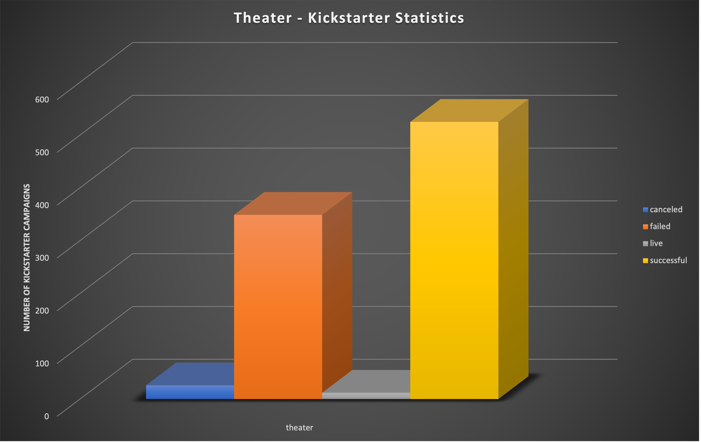
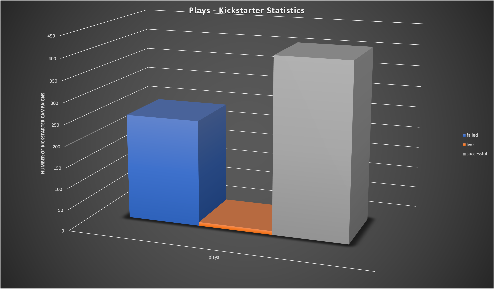

# An Analysis of Kickstarter Campaigns

## Description of Project
   The following Data Analysis was performed to help Louise, an upcoming Playwright, to decide on a 
   plan of action to successfully set up a Crowd Funding campaign for her play Fever.  I have researched
   data for her and come up with trends and statistics that, if implemented could help her succeed in 
   this campaign.
  
 ## Statistics on Theater Kickstarter Campaigns
    
    
    * As you can see, Theater Kickstarter Campaigns 1.5x more likely to succeed than fail, so it does show with the
      right play, you can get the funding you need to succeed.
    
    
    
    * The subcategory, Plays under Theater are just about 2 times more successful than not. So Louise, you are
      right on track with wanting to start a Crowd Funding campaign for your play, Fever.
    
    
    
    * The most successful Plays with a Kickstarter campaign, launch in the month of May. The statistics are over 90%!!!
      That is a definite must for you to schedule your campaign to kick off in May.
    
    
    
    * Looking at the mean goal of the Kickstarter Campaigns in Great Britain, it was 4,000 pounds (or $5543), and that was much
      more than anyone was able to pledge.  Even researching Kickstarter Campaigns in the US, the mean goal was only 
      $5,049 (or 3,643 pounds) so lower than the goal of the Great Britain mean goal.  This is concerning as your cost
      estimates are over $10,000.  
    
   
  ## Recommendations for Louise and play Fever [Kickstarter Data](hughes-kickstarter.xlsx.zip)
  
    1.  Schedule your campaign to kick of the beginning of May.
    2.  See if you can reduce the required costs of the play, due to the statistics of funding limits.
    
